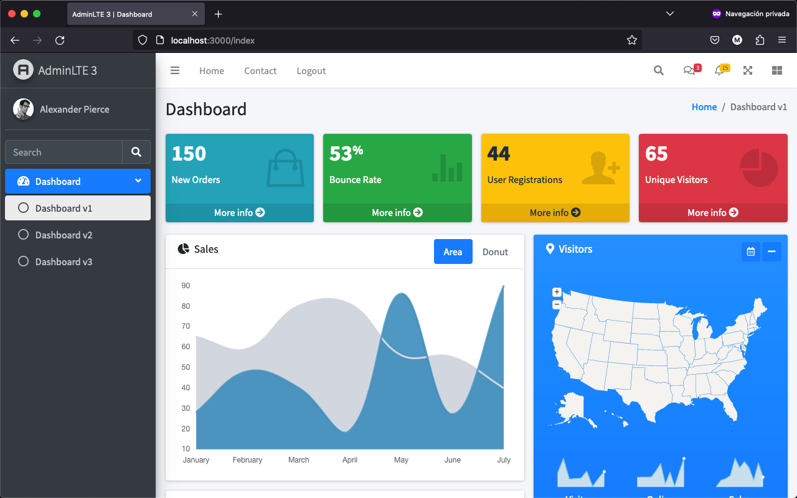
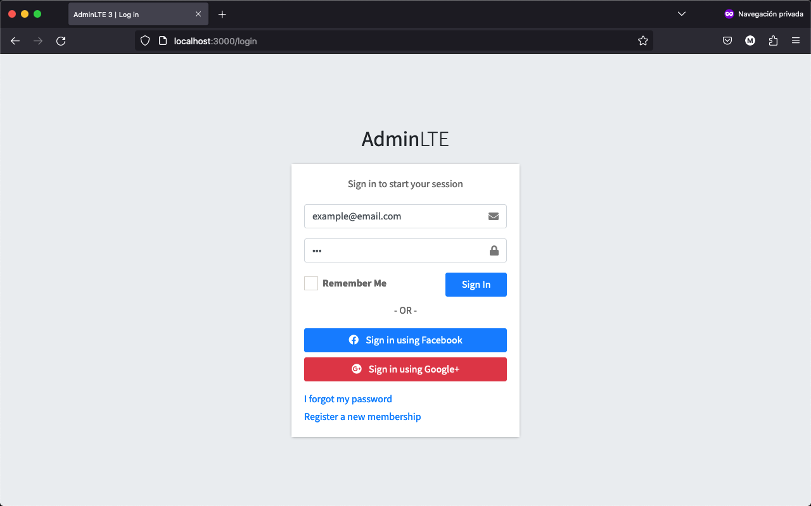

# AdminLTE-expressjs4

This project is an implementation of the AdminLTE admin panel template in an Express.js application using EJS templates.

## Table of Contents

- [Description](#description)
- [Features](#features)
- [Live Demo](#live-demo)
- [Screenshots](#screenshots)
- [System Requirements](#system-requirements)
- [Installation](#installation)
- [Usage](#usage)
- [Project Structure](#project-structure)
- [License](#license)

## Description

This project serves as a starting point for integrating the AdminLTE template into an Express.js application. It provides a clean and organized structure to build web applications with an admin panel.

## Features

- **AdminLTE Integration**: Utilizes the AdminLTE admin panel template for a sleek and user-friendly interface.

- **Routes and Controllers**: Includes examples of route configuration and controllers for building application functionality.

- **Static Files**: Efficiently manages static files (CSS, JavaScript, images, etc.) in the `public` directory.

- **Documentation**: Provides an organized structure and basic guidance to get started.

## Live Demo

You can check out a live demo of this project at [demo_link_here](#).

## Screenshots





## System Requirements

- Node.js and npm installed on your machine.

## Installation

1. **Clone this repository**:
   ```bash 
   git clone https://github.com/al3xis-01/AdminLTE-expressjs4.git

2. **Navigate to the project directory**:
    
    ```bash
   cd AdminLTE-expressjs4

3. **Install dependencies**:

    ```bash
    npm install

## Usage

1. **Start the application**:
   ```bash
    npm start
2. **Open your web browser and access http://localhost:3000 to view the application**:

## Project Structure
The project structure is as follows:

## License
This project is licensed under the MIT License. See the LICENSE file for more details.

